<!-- DARK MODE HERO -->
<picture>
  <source media="(prefers-color-scheme: dark)" srcset="dark.svg">
  <source media="(prefers-color-scheme: light)" srcset="light.svg">
  
</picture>

💫 About Me
I am Muhammad Umar Asghar, an Artificial Intelligence undergraduate passionate about developing practical AI solutions using Machine Learning, Deep Learning, NLP, Computer Vision, and intelligent automation.
I enjoy building end-to-end AI applications, from data processing and model development to web deployment, using technologies such as Python, Scikit-learn, TensorFlow, Flask, Django, and JavaScript.
With a strong interest in Explainable AI, AI Governance, and Responsible AI, I strive to create transparent, reliable, and impactful intelligent systems while continuously learning and contributing to open-source projects.
🌐 Connect With Me

  
  

💻 Tech Stack

  
  
  
  
  
  
  
  
  
  
  
  
  
  
  
  
  
  
  
  
  
  
  
  
  
  

📊 GitHub Stats

  
  

  

🏆 GitHub Trophies

  

🔝 Top Contributed Repositories

  

  

